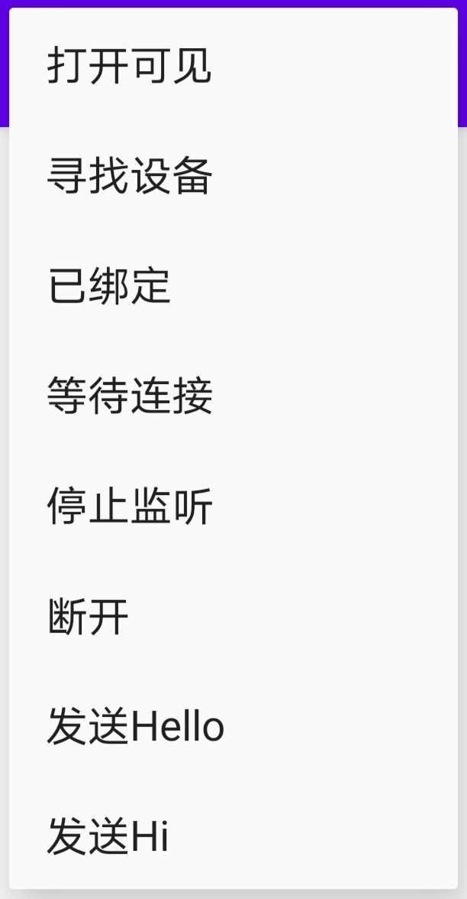
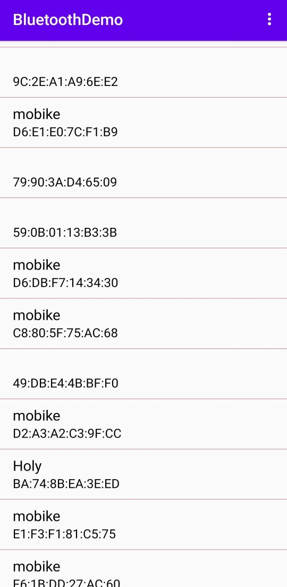
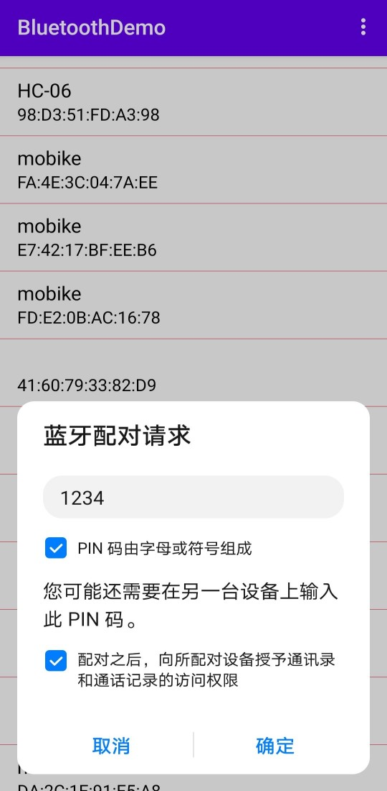
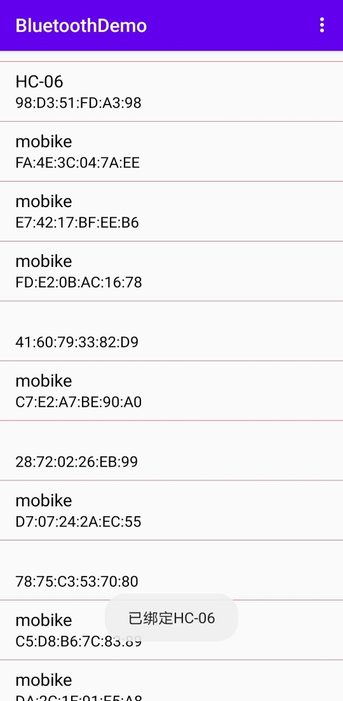
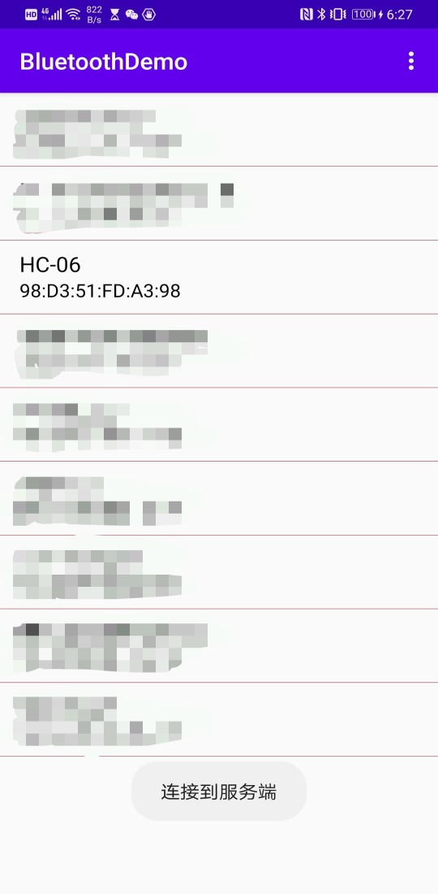
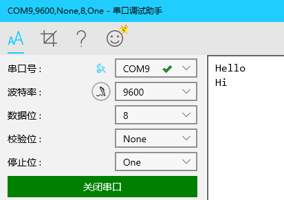
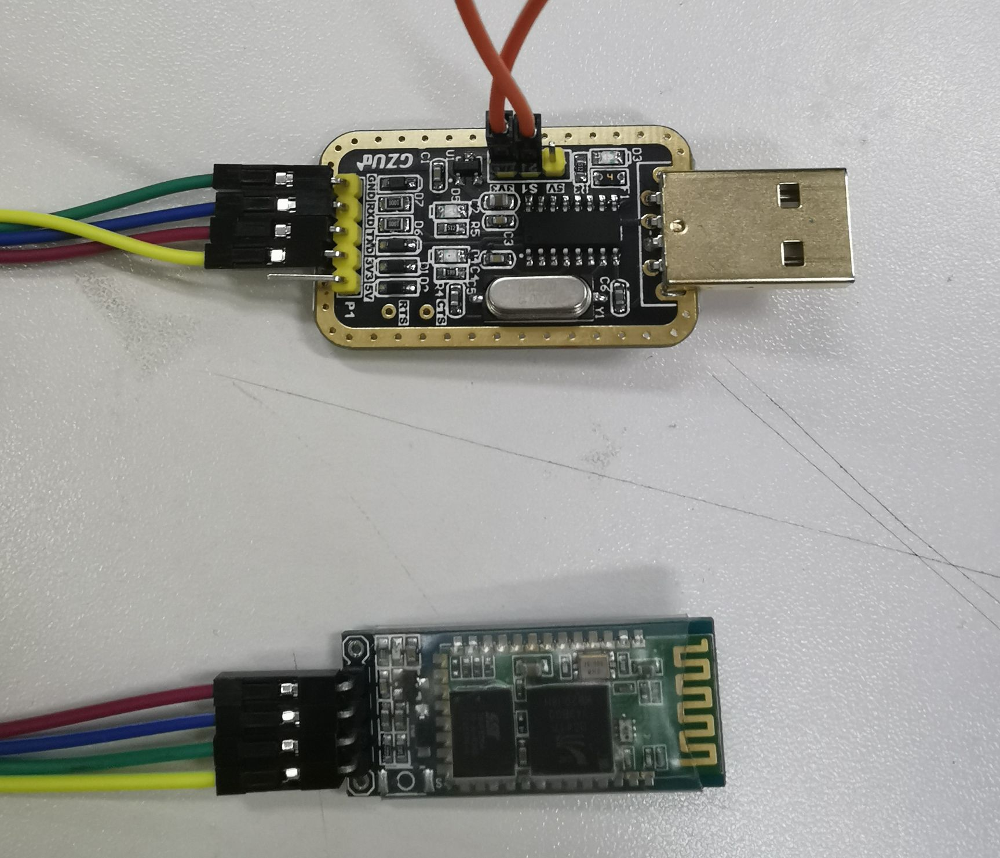

# 安卓蓝牙Demo

## 开篇提示

本App基于**蓝牙2.0**开发，还请注意

## 软件下载

[app-debug.apk下载](https://github.com/Mashiro2019/BluetoothDemo/blob/master/app-debug.apk)

## 权限设置

需要开启**蓝牙权限**和**定位权限**

开启定位权限是由于 **Android 10.+** 以上的要求

## 操作提示

应用Demo主要提供以下几种功能：

- 打开可见性

  **此操作是必要的**，点击菜单栏的 **打开可见** 使得自己的设备能够被查看到

- 寻找设备

  点击 **寻找设备** 会搜索附近蓝牙设备

  

  点击列表中的设备即可配对，我们以 **HC-06** 为例

  

  绑定成功会有弹窗提示

  

- 已绑定

  点击 **已绑定** 会显示已绑定设备，我们点击已绑定设备进行连接，连接成功会有弹窗提示，我们以 **HC-06** 为例
  
  

- 发送Hello Hi

  连接成功后，打开串口助手，点击App菜单栏内的 **发送Hello**，**发送Hi**，可以在串口助手看到消息

  

## 调试设备

**蓝牙模块** 和 **TTL转USB**

